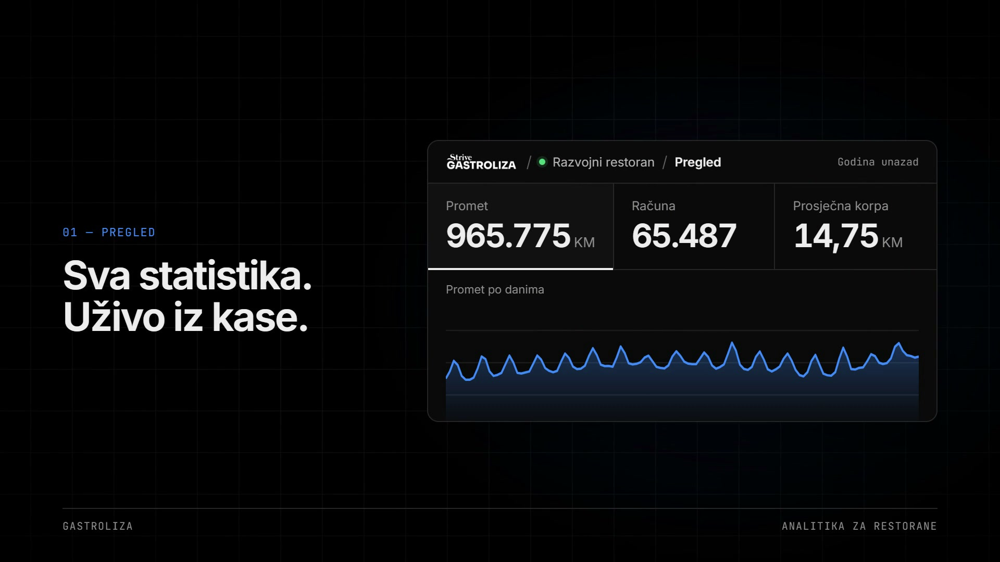
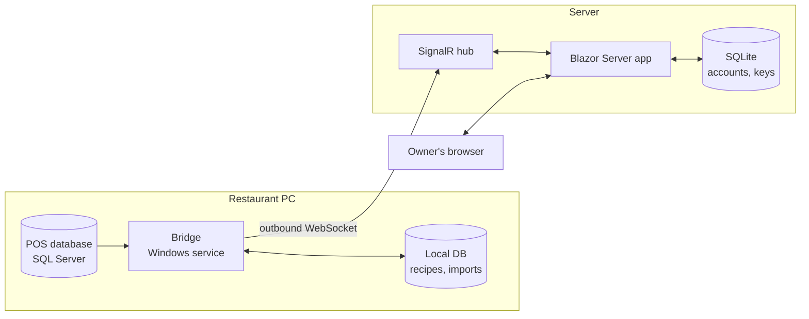

# Gastroliza

**Restaurant analytics from the cash register, in the browser.**

Restaurant owners know a night was busy, but not the numbers behind it. Gastroliza connects to the point-of-sale (POS) database a restaurant already runs and turns it into a live dashboard: revenue, receipts, waiter rankings, recipe-based ingredient consumption and a forecast of what will be needed in the coming weeks.



**Stack:** .NET 8 · ASP.NET Core · Blazor Server · SignalR · MudBlazor · ApexCharts · Dapper · SQL Server · SQLite · xUnit

---

## How it works

The POS database lives on a PC inside the restaurant, behind a router nobody wants to open ports on. Gastroliza solves this with a small Windows service, the **bridge** (`Analitika.Agent`), that runs next to the POS and connects *outbound* to the server over SignalR.



1. The owner opens a dashboard page. The server sends the bridge a **query name** plus parameters, never SQL.
2. The bridge looks up that name in a fixed SQL catalogue, runs it against the POS database and returns only aggregated results.
3. The server renders charts and tables. Raw sales data never leaves the restaurant.

## Features

| Page | What it shows |
|---|---|
| **Overview** | Revenue, receipts, average basket, revenue per day and per hour, busiest times heat map, food vs. drinks share |
| **Articles** | Top 15 products, sortable by revenue or quantity sold |
| **Waiters** | Rankings by revenue and by items sold, share of total revenue |
| **Recipes** (Normativi) | Ingredient quantities per menu item, editable in the browser |
| **Consumption** | Ingredients used in a period, calculated from sales × recipes |
| **Forecast** | Expected sales and ingredient needs for a future period, with a P25 to P75 range |
| **Connect POS** | Connection status and a downloadable bridge installer (zip with a one-time pairing code built in) |

## Engineering decisions

**Security**
- **No inbound ports at the restaurant.** The bridge dials out, so the client network stays closed.
- **The server can't run arbitrary SQL.** All POS queries live in [`SqlKatalog.cs`](src/Analitika.Agent/Queries/SqlKatalog.cs). The server sends an enum value ([`ImeUpita`](src/Analitika.Shared/Upiti/ImeUpita.cs)). Database names are validated with a regex before `QUOTENAME`.
- **Bridge keys** are encrypted at rest with Windows DPAPI (machine scope), so a copied key file is useless on another PC. The server stores only hashes.
- **Pairing** uses a 30-minute one-time code from an alphabet without look-alike characters (no 0/O, 1/I/L). The endpoint is rate-limited to 10 attempts per minute per IP.
- **Accounts:** passwords are hashed with ASP.NET Core Identity's `PasswordHasher`. Unknown emails are verified against a dummy hash, so response time doesn't reveal which accounts exist. Data-protection keys are persisted, so restarts don't log users out.

**Forecasting model** ([`Projekcija.cs`](src/Analitika.Server/Servisi/Projekcija.cs))

`forecast(day) = median sales for that weekday × monthly seasonal index`

- The model is deliberately simple and explainable. With one or two years of data, ARIMA or Prophet tend to fit noise and suggest false precision.
- Median instead of mean, so a single holiday doesn't skew the result.
- A 4-week base window instead of 8, because restaurant demand shifts fast. This was checked against real data: the 8-week window predicted 71 units for an item that actually sold 51.
- Results come with a P25 to P75 range and the number of days the estimate is based on.

**Other**
- The whole app runs in the Bosnian culture (`bs-Latn-BA`, falling back to `hr-HR`), so "0,18" is parsed as 0.18, not 18.
- Older years can be imported from CSV into a local database and queried together with live POS data (`UNION ALL` across sources, with collation fixes).

## Project structure

```
src/
  Analitika.Shared/   query contracts shared by server and bridge
  Analitika.Agent/    the bridge: Windows service, POS queries, DPAPI key storage, installer scripts
  Analitika.Server/   Blazor Server app, SignalR hub, accounts, forecasting
tests/
  Analitika.Tests/    xUnit tests: forecasting, recipes, CSV import, accounts, SQL access
db/
  analitika.sql       schema of the local database on the client's SQL Server
```

## Running locally

Requirements: .NET 8 SDK on Windows.

```bash
dotnet run --project src/Analitika.Server
```

The app starts at `http://localhost:5226`. In development, a test account and a development restaurant are created from `appsettings.Development.json`.

To see real data, the bridge needs a SQL Server instance with a POS database:

```bash
dotnet run --project src/Analitika.Agent
```

Tests:

```bash
dotnet test
```

All 63 tests pass. Tests that need a local POS database are skipped automatically when it isn't available.

## Roadmap

- AI assistant that answers questions like *"How much flour do I need for the next two weeks?"* using the forecast

## A note on naming

The code is written in Bosnian, the language of the product's users. Key terms:

| Bosnian | English |
|---|---|
| Most | Bridge (the on-site agent) |
| Upit / Izvršilac | Query / Executor |
| Normativ | Recipe (ingredients per menu item) |
| Utrošak | Consumption |
| Projekcija | Forecast |
| Konobar | Waiter |
| Nalog / Prijava | Account / Login |
| Ključ / Uparivanje | Key / Pairing |
